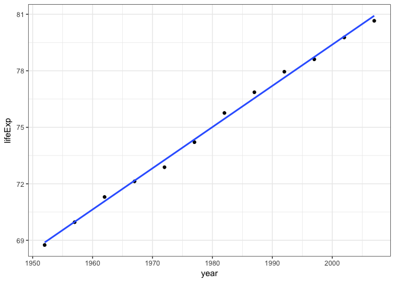
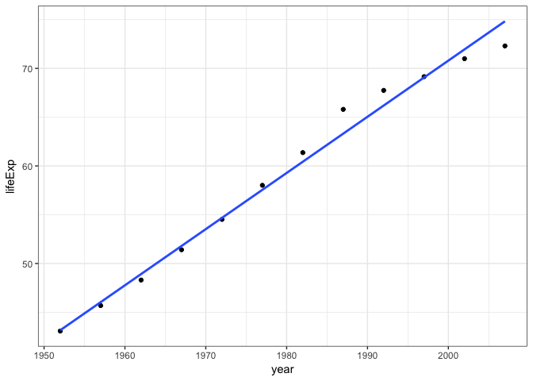
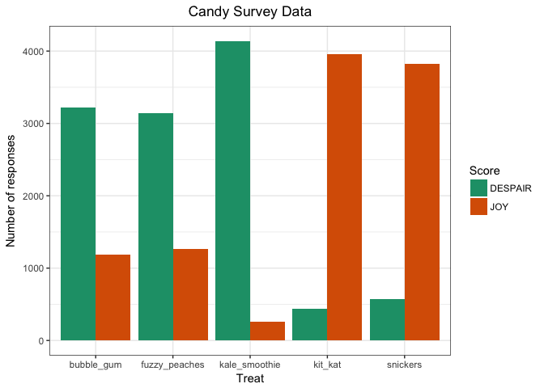

STAT547 Homework 06: Data wrangling wrap up
================

### Load packages

Load necessary packages.

``` r
library(tidyverse)
library(stringr)
library(knitr)
library(gapminder)
library(ggplot2)
library(MASS)
library(repurrrsive)
library(listviewer)
library(jsonlite)
library(dplyr)
library(tibble)
library(purrr)
```

2. Writing functions
--------------------

Write a function to compute the robust regression of life expectancy on year with the Gapminder data. `MASS::rlm()` will be used.

#### Practice with some data

Extract data for one country to interactively work with the code.

``` r
p_country <- "Canada"
p_dat <- gapminder %>%
    filter(country == p_country)

kable(p_dat)
```

| country | continent |  year|  lifeExp|       pop|  gdpPercap|
|:--------|:----------|-----:|--------:|---------:|----------:|
| Canada  | Americas  |  1952|   68.750|  14785584|   11367.16|
| Canada  | Americas  |  1957|   69.960|  17010154|   12489.95|
| Canada  | Americas  |  1962|   71.300|  18985849|   13462.49|
| Canada  | Americas  |  1967|   72.130|  20819767|   16076.59|
| Canada  | Americas  |  1972|   72.880|  22284500|   18970.57|
| Canada  | Americas  |  1977|   74.210|  23796400|   22090.88|
| Canada  | Americas  |  1982|   75.760|  25201900|   22898.79|
| Canada  | Americas  |  1987|   76.860|  26549700|   26626.52|
| Canada  | Americas  |  1992|   77.950|  28523502|   26342.88|
| Canada  | Americas  |  1997|   78.610|  30305843|   28954.93|
| Canada  | Americas  |  2002|   79.770|  31902268|   33328.97|
| Canada  | Americas  |  2007|   80.653|  33390141|   36319.24|

Plot the data to see what it looks like!

``` r
p <- ggplot(p_dat, aes(x = year, y = lifeExp))
p + geom_point() + geom_smooth(method = "rlm", se = FALSE) + theme_bw()
```



#### Practice with working code

Fit the robust regression.

``` r
p_fit <- rlm(lifeExp ~ year, p_dat)
coef(p_fit)
```

    ##  (Intercept)         year 
    ## -358.3036895    0.2188468

Hmm... it doesn't seem quite right that life expectancy was about -358. Let's make this more appropriate and set life expectancy to the earliest year in Gapminder (1952).

``` r
p_fit <- rlm(lifeExp ~ I(year - 1952), p_dat)
coef(p_fit)
```

    ##    (Intercept) I(year - 1952) 
    ##     68.8853510      0.2188468

#### Turn the working code into a function!

``` r
robust_fit <- function(dat, offset = 1952) {
  the_fit <- rlm(lifeExp ~ I(year - offset), dat)
  setNames(coef(the_fit), c("intercept", "slope"))
}
robust_fit(p_dat)
```

    ##  intercept      slope 
    ## 68.8853510  0.2188468

Hooray, we get the same result as above!

#### Test the function on other data

Let's look at the robust regression of life expectancy on year in Algeria.

``` r
p_country2 <- "Algeria"
p_dat2 <- gapminder %>%
    filter(country == p_country2)

kable(p_dat2)
```

| country | continent |  year|  lifeExp|       pop|  gdpPercap|
|:--------|:----------|-----:|--------:|---------:|----------:|
| Algeria | Africa    |  1952|   43.077|   9279525|   2449.008|
| Algeria | Africa    |  1957|   45.685|  10270856|   3013.976|
| Algeria | Africa    |  1962|   48.303|  11000948|   2550.817|
| Algeria | Africa    |  1967|   51.407|  12760499|   3246.992|
| Algeria | Africa    |  1972|   54.518|  14760787|   4182.664|
| Algeria | Africa    |  1977|   58.014|  17152804|   4910.417|
| Algeria | Africa    |  1982|   61.368|  20033753|   5745.160|
| Algeria | Africa    |  1987|   65.799|  23254956|   5681.359|
| Algeria | Africa    |  1992|   67.744|  26298373|   5023.217|
| Algeria | Africa    |  1997|   69.152|  29072015|   4797.295|
| Algeria | Africa    |  2002|   70.994|  31287142|   5288.040|
| Algeria | Africa    |  2007|   72.301|  33333216|   6223.367|

Plot the data!

``` r
p2 <- ggplot(p_dat2, aes(x = year, y = lifeExp))
p2 + geom_point() + geom_smooth(method = "rlm", se = FALSE) + theme_bw()
```



Use our function!

``` r
robust_fit(p_dat2)
```

    ##  intercept      slope 
    ## 43.1580026  0.5758313

It works! This function calculates the robust regression of life expectancy on year (with the earliest year of 1952).

3. Work with the candy data
---------------------------

#### TASK: Compare the joy/despair scores of different types of treats.

#### Examine the raw Candy Survey data

Bring in the raw data.

``` r
raw <- read_csv("CANDY-HIERARCHY-2015 SURVEY-Responses.csv",
                col_types = cols(
                  Timestamp = col_datetime("%m/%d/%Y %H:%M:%S")))
```

Glimpse of the data.

``` r
glimpse(raw)
```

    ## Observations: 5,658
    ## Variables: 124
    ## $ Timestamp                                                                                                           <dttm> ...
    ## $ `How old are you?`                                                                                                  <chr> ...
    ## $ `Are you going actually going trick or treating yourself?`                                                          <chr> ...
    ## $ `[Butterfinger]`                                                                                                    <chr> ...
    ## $ `[100 Grand Bar]`                                                                                                   <chr> ...
    ## $ `[Anonymous brown globs that come in black and orange wrappers]`                                                    <chr> ...
    ## $ `[Any full-sized candy bar]`                                                                                        <chr> ...
    ## $ `[Black Jacks]`                                                                                                     <chr> ...
    ## $ `[Bonkers]`                                                                                                         <chr> ...
    ## $ `[Bottle Caps]`                                                                                                     <chr> ...
    ## $ `[Box’o’ Raisins]`                                                                                                  <chr> ...
    ## $ `[Brach products (not including candy corn)]`                                                                       <chr> ...
    ## $ `[Bubble Gum]`                                                                                                      <chr> ...
    ## $ `[Cadbury Creme Eggs]`                                                                                              <chr> ...
    ## $ `[Candy Corn]`                                                                                                      <chr> ...
    ## $ `[Vials of pure high fructose corn syrup, for main-lining into your vein]`                                          <chr> ...
    ## $ `[Candy that is clearly just the stuff given out for free at restaurants]`                                          <chr> ...
    ## $ `[Cash, or other forms of legal tender]`                                                                            <chr> ...
    ## $ `[Chiclets]`                                                                                                        <chr> ...
    ## $ `[Caramellos]`                                                                                                      <chr> ...
    ## $ `[Snickers]`                                                                                                        <chr> ...
    ## $ `[Dark Chocolate Hershey]`                                                                                          <chr> ...
    ## $ `[Dental paraphenalia]`                                                                                             <chr> ...
    ## $ `[Dots]`                                                                                                            <chr> ...
    ## $ `[Fuzzy Peaches]`                                                                                                   <chr> ...
    ## $ `[Generic Brand Acetaminophen]`                                                                                     <chr> ...
    ## $ `[Glow sticks]`                                                                                                     <chr> ...
    ## $ `[Broken glow stick]`                                                                                               <chr> ...
    ## $ `[Goo Goo Clusters]`                                                                                                <chr> ...
    ## $ `[Good N' Plenty]`                                                                                                  <chr> ...
    ## $ `[Gum from baseball cards]`                                                                                         <chr> ...
    ## $ `[Gummy Bears straight up]`                                                                                         <chr> ...
    ## $ `[Creepy Religious comics/Chick Tracts]`                                                                            <chr> ...
    ## $ `[Healthy Fruit]`                                                                                                   <chr> ...
    ## $ `[Heath Bar]`                                                                                                       <chr> ...
    ## $ `[Hershey’s Kissables]`                                                                                             <chr> ...
    ## $ `[Hershey’s Milk Chocolate]`                                                                                        <chr> ...
    ## $ `[Hugs (actual physical hugs)]`                                                                                     <chr> ...
    ## $ `[Jolly Rancher (bad flavor)]`                                                                                      <chr> ...
    ## $ `[Jolly Ranchers (good flavor)]`                                                                                    <chr> ...
    ## $ `[Kale smoothie]`                                                                                                   <chr> ...
    ## $ `[Kinder Happy Hippo]`                                                                                              <chr> ...
    ## $ `[Kit Kat]`                                                                                                         <chr> ...
    ## $ `[Hard Candy]`                                                                                                      <chr> ...
    ## $ `[Lapel Pins]`                                                                                                      <chr> ...
    ## $ `[LemonHeads]`                                                                                                      <chr> ...
    ## $ `[Licorice]`                                                                                                        <chr> ...
    ## $ `[Licorice (not black)]`                                                                                            <chr> ...
    ## $ `[Lindt Truffle]`                                                                                                   <chr> ...
    ## $ `[Lollipops]`                                                                                                       <chr> ...
    ## $ `[Mars]`                                                                                                            <chr> ...
    ## $ `[Mary Janes]`                                                                                                      <chr> ...
    ## $ `[Maynards]`                                                                                                        <chr> ...
    ## $ `[Milk Duds]`                                                                                                       <chr> ...
    ## $ `[LaffyTaffy]`                                                                                                      <chr> ...
    ## $ `[Minibags of chips]`                                                                                               <chr> ...
    ## $ `[JoyJoy (Mit Iodine)]`                                                                                             <chr> ...
    ## $ `[Reggie Jackson Bar]`                                                                                              <chr> ...
    ## $ `[Pixy Stix]`                                                                                                       <chr> ...
    ## $ `[Nerds]`                                                                                                           <chr> ...
    ## $ `[Nestle Crunch]`                                                                                                   <chr> ...
    ## $ `[Now'n'Laters]`                                                                                                    <chr> ...
    ## $ `[Pencils]`                                                                                                         <chr> ...
    ## $ `[Milky Way]`                                                                                                       <chr> ...
    ## $ `[Reese’s Peanut Butter Cups]`                                                                                      <chr> ...
    ## $ `[Tolberone something or other]`                                                                                    <chr> ...
    ## $ `[Runts]`                                                                                                           <chr> ...
    ## $ `[Junior Mints]`                                                                                                    <chr> ...
    ## $ `[Senior Mints]`                                                                                                    <chr> ...
    ## $ `[Mint Kisses]`                                                                                                     <chr> ...
    ## $ `[Mint Juleps]`                                                                                                     <chr> ...
    ## $ `[Mint Leaves]`                                                                                                     <chr> ...
    ## $ `[Peanut M&M’s]`                                                                                                    <chr> ...
    ## $ `[Regular M&Ms]`                                                                                                    <chr> ...
    ## $ `[Mint M&Ms]`                                                                                                       <chr> ...
    ## $ `[Ribbon candy]`                                                                                                    <chr> ...
    ## $ `[Rolos]`                                                                                                           <chr> ...
    ## $ `[Skittles]`                                                                                                        <chr> ...
    ## $ `[Smarties (American)]`                                                                                             <chr> ...
    ## $ `[Smarties (Commonwealth)]`                                                                                         <chr> ...
    ## $ `[Chick-o-Sticks (we don’t know what that is)]`                                                                     <chr> ...
    ## $ `[Spotted Dick]`                                                                                                    <chr> ...
    ## $ `[Starburst]`                                                                                                       <chr> ...
    ## $ `[Swedish Fish]`                                                                                                    <chr> ...
    ## $ `[Sweetums]`                                                                                                        <chr> ...
    ## $ `[Those odd marshmallow circus peanut things]`                                                                      <chr> ...
    ## $ `[Three Musketeers]`                                                                                                <chr> ...
    ## $ `[Peterson Brand Sidewalk Chalk]`                                                                                   <chr> ...
    ## $ `[Peanut Butter Bars]`                                                                                              <chr> ...
    ## $ `[Peanut Butter Jars]`                                                                                              <chr> ...
    ## $ `[Trail Mix]`                                                                                                       <chr> ...
    ## $ `[Twix]`                                                                                                            <chr> ...
    ## $ `[Vicodin]`                                                                                                         <chr> ...
    ## $ `[White Bread]`                                                                                                     <chr> ...
    ## $ `[Whole Wheat anything]`                                                                                            <chr> ...
    ## $ `[York Peppermint Patties]`                                                                                         <chr> ...
    ## $ `Please leave any remarks or comments regarding your choices.`                                                      <chr> ...
    ## $ `Please list any items not included above that give you JOY.`                                                       <chr> ...
    ## $ `Please list any items not included above that give you DESPAIR.`                                                   <chr> ...
    ## $ `Guess the number of mints in my hand.`                                                                             <chr> ...
    ## $ `Betty or Veronica?`                                                                                                <chr> ...
    ## $ `Check all that apply: "I cried tears of sadness at the end of  ____________"`                                      <chr> ...
    ## $ `"That dress* that went viral early this year - when I first saw it, it was ________"`                              <chr> ...
    ## $ `Fill in the blank: "Taylor Swift is a force for ___________"`                                                      <chr> ...
    ## $ `What is your favourite font?`                                                                                      <chr> ...
    ## $ `If you squint really hard, the words "Intelligent Design" would look like.`                                        <chr> ...
    ## $ `Fill in the blank: "Imitation is a form of ____________"`                                                          <chr> ...
    ## $ `Please estimate the degree(s) of separation you have from the following celebrities [JK Rowling]`                  <chr> ...
    ## $ `Please estimate the degree(s) of separation you have from the following celebrities [JJ Abrams]`                   <chr> ...
    ## $ `Please estimate the degree(s) of separation you have from the following celebrities [Beyoncé]`                     <chr> ...
    ## $ `Please estimate the degree(s) of separation you have from the following celebrities [Bieber]`                      <chr> ...
    ## $ `Please estimate the degree(s) of separation you have from the following celebrities [Kevin Bacon]`                 <chr> ...
    ## $ `Please estimate the degree(s) of separation you have from the following celebrities [Francis Bacon (1561 - 1626)]` <chr> ...
    ## $ `[Sea-salt flavored stuff, probably chocolate, since this is the "it" flavor of the year]`                          <chr> ...
    ## $ `[Necco Wafers]`                                                                                                    <chr> ...
    ## $ `Which day do you prefer, Friday or Sunday?`                                                                        <chr> ...
    ## $ `Please estimate the degrees of separation you have from the following folks [Bruce Lee]`                           <chr> ...
    ## $ `Please estimate the degrees of separation you have from the following folks [JK Rowling]`                          <chr> ...
    ## $ `Please estimate the degrees of separation you have from the following folks [Malala Yousafzai]`                    <chr> ...
    ## $ `Please estimate the degrees of separation you have from the following folks [Thom Yorke]`                          <chr> ...
    ## $ `Please estimate the degrees of separation you have from the following folks [JJ Abrams]`                           <chr> ...
    ## $ `Please estimate the degrees of separation you have from the following folks [Hillary Clinton]`                     <chr> ...
    ## $ `Please estimate the degrees of separation you have from the following folks [Donald Trump]`                        <chr> ...
    ## $ `Please estimate the degrees of separation you have from the following folks [Beyoncé Knowles]`                     <chr> ...

#### Data wrangling

Create an ID for each participant and rename "How old are you?" to `age`.

``` r
raw_id <- raw %>% 
  mutate(id = rownames(raw)) %>%
  rename(age = "How old are you?")
```

Clean the `age` data to be integers of data with two or less characters and drop the rows with NA.

``` r
raw_id <- raw_id %>% 
  filter(str_length(age) <= 2) %>% 
  mutate(age = as.integer(age)) %>%
  filter(!is.na(age))
```

    ## Warning in evalq(as.integer(age), <environment>): NAs introduced by
    ## coercion

Select data of interest from the Candy Survey. We will look at `id`, `age`, `bubble gum`, `snickers`, `fuzzy peaches`, `kale smoothie`, and `kit kat`, and rename the treats.

``` r
candy_data <- raw_id %>% 
  rename(bubble_gum = "[Bubble Gum]",
         snickers = "[Snickers]",
         fuzzy_peaches = "[Fuzzy Peaches]",
         kale_smoothie = "[Kale smoothie]",
         kit_kat = "[Kit Kat]") %>% 
  dplyr::select(id, age, bubble_gum, snickers, fuzzy_peaches, kale_smoothie, kit_kat)

candy_data
```

    ## # A tibble: 5,351 x 7
    ##       id   age bubble_gum snickers fuzzy_peaches kale_smoothie kit_kat
    ##    <chr> <int>      <chr>    <chr>         <chr>         <chr>   <chr>
    ##  1     1    35    DESPAIR      JOY       DESPAIR          <NA>    <NA>
    ##  2     2    41    DESPAIR      JOY       DESPAIR       DESPAIR     JOY
    ##  3     3    33    DESPAIR      JOY       DESPAIR       DESPAIR     JOY
    ##  4     4    31    DESPAIR      JOY       DESPAIR       DESPAIR     JOY
    ##  5     5    30       <NA>     <NA>           JOY          <NA>    <NA>
    ##  6     6    38    DESPAIR  DESPAIR           JOY       DESPAIR     JOY
    ##  7     7    48    DESPAIR      JOY           JOY       DESPAIR     JOY
    ##  8     8    39       <NA>      JOY           JOY       DESPAIR     JOY
    ##  9    10    54    DESPAIR      JOY       DESPAIR       DESPAIR     JOY
    ## 10    11    40        JOY      JOY           JOY       DESPAIR     JOY
    ## # ... with 5,341 more rows

Clean up the candy data and drop all rows with NA.

``` r
candy_data <- na.omit(candy_data)

candy_data
```

    ## # A tibble: 4,400 x 7
    ##       id   age bubble_gum snickers fuzzy_peaches kale_smoothie kit_kat
    ##    <chr> <int>      <chr>    <chr>         <chr>         <chr>   <chr>
    ##  1     2    41    DESPAIR      JOY       DESPAIR       DESPAIR     JOY
    ##  2     3    33    DESPAIR      JOY       DESPAIR       DESPAIR     JOY
    ##  3     4    31    DESPAIR      JOY       DESPAIR       DESPAIR     JOY
    ##  4     6    38    DESPAIR  DESPAIR           JOY       DESPAIR     JOY
    ##  5     7    48    DESPAIR      JOY           JOY       DESPAIR     JOY
    ##  6    10    54    DESPAIR      JOY       DESPAIR       DESPAIR     JOY
    ##  7    11    40        JOY      JOY           JOY       DESPAIR     JOY
    ##  8    12    38    DESPAIR      JOY       DESPAIR       DESPAIR DESPAIR
    ##  9    16    60        JOY      JOY           JOY       DESPAIR     JOY
    ## 10    17    34    DESPAIR      JOY       DESPAIR       DESPAIR     JOY
    ## # ... with 4,390 more rows

#### Exploring/Analyzing

First, let's examine the number of occurences of despair and join for bubble gum using `count()`.

``` r
bubble_gum_count <- candy_data %>%
  count(bubble_gum) %>% 
  ## rename table headings
  rename(bubble_gum = n,
         score = bubble_gum)

kable(bubble_gum_count)
```

| score   |  bubble\_gum|
|:--------|------------:|
| DESPAIR |         3218|
| JOY     |         1182|

We see that 3218 people scored bubble gum with `despair`, and 1182 with `joy`.

Let's look at snickers.

``` r
snickers_count <- candy_data %>%
  count(snickers) %>% 
  ## rename table headings
  rename(snickers = n, 
         score = snickers)

kable(snickers_count)
```

| score   |  snickers|
|:--------|---------:|
| DESPAIR |       574|
| JOY     |      3826|

We can join these two tables using `inner_join()`.

``` r
gum_and_snickers <- inner_join(bubble_gum_count, snickers_count)
```

    ## Joining, by = "score"

``` r
kable(gum_and_snickers)
```

| score   |  bubble\_gum|  snickers|
|:--------|------------:|---------:|
| DESPAIR |         3218|       574|
| JOY     |         1182|      3826|

Let's analyze the other treats using `count()`.

``` r
fuzzy_peaches_count <- candy_data %>%
  count(fuzzy_peaches) %>% 
  ## rename table headings
  rename(fuzzy_peaches = n,
         score = fuzzy_peaches)

kale_smoothie_count <- candy_data %>%
  count(kale_smoothie) %>% 
  ## rename table headings
  rename(kale_smoothie = n,
         score = kale_smoothie)

kit_kat_count <- candy_data %>%
  count(kit_kat) %>% 
  ## rename table headings
  rename(kit_kat = n,
         score = kit_kat)
```

We want to create a combined table with the total counts of despair and joy for each treat.

``` r
candy_scores <- plyr::join_all(list(bubble_gum_count, snickers_count, fuzzy_peaches_count,
              kale_smoothie_count, kit_kat_count),
              by='score',
              type='inner')

kable(candy_scores)
```

| score   |  bubble\_gum|  snickers|  fuzzy\_peaches|  kale\_smoothie|  kit\_kat|
|:--------|------------:|---------:|---------------:|---------------:|---------:|
| DESPAIR |         3218|       574|            3139|            4141|       441|
| JOY     |         1182|      3826|            1261|             259|      3959|

Hooray! Let's plot this data!

..... WAIT, not so soon! We need to reshape this data to properly plot it.

``` r
candy_scores_gather <- gather(candy_scores, key = treat, value = count, bubble_gum:kit_kat)

kable(candy_scores_gather)
```

| score   | treat          |  count|
|:--------|:---------------|------:|
| DESPAIR | bubble\_gum    |   3218|
| JOY     | bubble\_gum    |   1182|
| DESPAIR | snickers       |    574|
| JOY     | snickers       |   3826|
| DESPAIR | fuzzy\_peaches |   3139|
| JOY     | fuzzy\_peaches |   1261|
| DESPAIR | kale\_smoothie |   4141|
| JOY     | kale\_smoothie |    259|
| DESPAIR | kit\_kat       |    441|
| JOY     | kit\_kat       |   3959|

Now it's ready to plot!

``` r
candy_scores_gather %>% 
  ggplot(aes(x = treat, y = count, fill = score)) +
  geom_bar(stat="identity", position = "dodge") +
  theme_bw() +
  labs(title = "Candy Survey Data",
       fill = "Score",
       x = "Treat",
       y = "Number of responses") +
  theme(plot.title = element_text(hjust=0.5)) +
  scale_fill_brewer("Score", palette="Dark2")
```



We can see that more individuals find joy in kit kat and snickers, than bubble gum, fuzzy peaches, and a kale smoothie (I think I do too).

5. Work with a list
-------------------

#### Simplifying data from a list of GitHub users

Using the `repurrrsive` package, we will examine information on 6 GitHub users named `gh_users`.

#### Extract an element based on name or position

Let's look at the elements with the name "login".

``` r
gh_users %>%
  map("login")
```

    ## [[1]]
    ## [1] "gaborcsardi"
    ## 
    ## [[2]]
    ## [1] "jennybc"
    ## 
    ## [[3]]
    ## [1] "jtleek"
    ## 
    ## [[4]]
    ## [1] "juliasilge"
    ## 
    ## [[5]]
    ## [1] "leeper"
    ## 
    ## [[6]]
    ## [1] "masalmon"

We can also use `map()` to look at an element based on its position.

``` r
gh_users %>%
  map(18)
```

    ## [[1]]
    ## [1] "Gábor Csárdi"
    ## 
    ## [[2]]
    ## [1] "Jennifer (Jenny) Bryan"
    ## 
    ## [[3]]
    ## [1] "Jeff L."
    ## 
    ## [[4]]
    ## [1] "Julia Silge"
    ## 
    ## [[5]]
    ## [1] "Thomas J. Leeper"
    ## 
    ## [[6]]
    ## [1] "Maëlle Salmon"

The 18th element is the name for each user.

#### Type-specific map

A type-specific `map()` returns an atomic vector, while `map()` returns a list.

We can use our examples above with `map_chr()` (since the elements are all characters) to return an atomic vector.

``` r
gh_users %>%
  map_chr("login")
```

    ## [1] "gaborcsardi" "jennybc"     "jtleek"      "juliasilge"  "leeper"     
    ## [6] "masalmon"

``` r
gh_users %>%
  map_chr(18)
```

    ## [1] "Gábor Csárdi"           "Jennifer (Jenny) Bryan"
    ## [3] "Jeff L."                "Julia Silge"           
    ## [5] "Thomas J. Leeper"       "Maëlle Salmon"

#### Extract multiple values

We will extract data from the 2 and 3rd users. We can use the single square bracket to index and a character vector to index by name.

``` r
x <- map(gh_users, `[`, c("login", "name", "id", "location"))
str(x[2:3])
```

    ## List of 2
    ##  $ :List of 4
    ##   ..$ login   : chr "jennybc"
    ##   ..$ name    : chr "Jennifer (Jenny) Bryan"
    ##   ..$ id      : int 599454
    ##   ..$ location: chr "Vancouver, BC, Canada"
    ##  $ :List of 4
    ##   ..$ login   : chr "jtleek"
    ##   ..$ name    : chr "Jeff L."
    ##   ..$ id      : int 1571674
    ##   ..$ location: chr "Baltimore,MD"

#### Data frame output

We can also return elements in a data frame with `map_df()`.

``` r
map_df(gh_users, `[`, c("login", "name", "id", "location"))
```

    ## # A tibble: 6 x 4
    ##         login                   name       id               location
    ##         <chr>                  <chr>    <int>                  <chr>
    ## 1 gaborcsardi           Gábor Csárdi   660288         Chippenham, UK
    ## 2     jennybc Jennifer (Jenny) Bryan   599454  Vancouver, BC, Canada
    ## 3      jtleek                Jeff L.  1571674           Baltimore,MD
    ## 4  juliasilge            Julia Silge 12505835     Salt Lake City, UT
    ## 5      leeper       Thomas J. Leeper  3505428 London, United Kingdom
    ## 6    masalmon          Maëlle Salmon  8360597       Barcelona, Spain

ALL DONE! Hope you learned something from this assignment!
