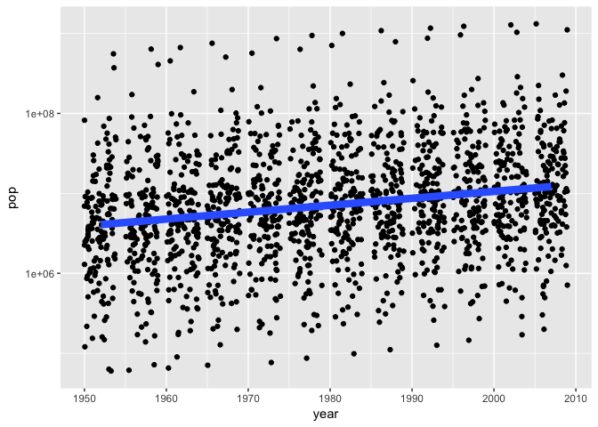

Hw07: Automating Data-analysis Pipelines
================
Amanda Cheung
11/15/2017

This assignment investigated the overall population trends in the Gapminder data.

Load packages and the data
--------------------------

Load necessary pacakges.

``` r
library(tidyverse)
library(ggplot2)
library(forcats)
library(knitr)
library(broom)
library(magrittr)
```

Gapminder data was brought in and factorised.

``` r
gapminder <- read_tsv("gapminder.tsv")
gapminder <- gapminder %>%
  mutate(country = factor(country),
         continent = factor(continent))
str(gapminder)
```

    ## Classes 'tbl_df', 'tbl' and 'data.frame':    1704 obs. of  6 variables:
    ##  $ country  : Factor w/ 142 levels "Afghanistan",..: 1 1 1 1 1 1 1 1 1 1 ...
    ##  $ continent: Factor w/ 5 levels "Africa","Americas",..: 3 3 3 3 3 3 3 3 3 3 ...
    ##  $ year     : int  1952 1957 1962 1967 1972 1977 1982 1987 1992 1997 ...
    ##  $ lifeExp  : num  28.8 30.3 32 34 36.1 ...
    ##  $ pop      : int  8425333 9240934 10267083 11537966 13079460 14880372 12881816 13867957 16317921 22227415 ...
    ##  $ gdpPercap: num  779 821 853 836 740 ...

Exploratory analyses
--------------------

Data exploration was performed and plotted.


Countries were reordered by maximum population in descending order

``` r
fct_reorder(gapminder$country, gapminder$pop, max, .desc = TRUE) %>% 
  levels() %>%
  head(10) %>% 
  kable()
```

|               |
|:--------------|
| China         |
| India         |
| United States |
| Indonesia     |
| Brazil        |
| Pakistan      |
| Bangladesh    |
| Nigeria       |
| Japan         |
| Mexico        |

Statistical analyses
--------------------

Fit a linear regression of population on year within each country.

``` r
gap_reorder <- gapminder %>% 
  mutate(country = fct_reorder(country, pop, max, .desc = TRUE))

ggplot(gap_reorder, aes(x = year, y = pop)) +
  geom_jitter() +
  geom_smooth(lwd = 3, se = FALSE, method = "lm") +
  scale_y_log10()
```



Create a function.

``` r
## Function
linear_fit <- function(dat, offset = 1952) {
  lm_fit <- lm(pop ~ I(year - offset), dat)
  setNames(data.frame(t(coef(lm_fit))), c("intercept", "slope"))
}
```

Fit for all countries.

``` r
## Fit for all countries
pop_fit1 <- gap_reorder %>%
  group_by(country) %>% 
  do(linear_fit(.))
pop_fit1
```

    ## # A tibble: 142 x 3
    ## # Groups:   country [142]
    ##          country intercept      slope
    ##           <fctr>     <dbl>      <dbl>
    ##  1         China 556263528 14614419.1
    ##  2         India 319382421 13881757.0
    ##  3 United States 158463562  2536278.9
    ##  4     Indonesia  73619295  2716492.3
    ##  5        Brazil  52602868  2534882.1
    ##  6      Pakistan  29011582  2351702.0
    ##  7    Bangladesh  38270692  1908534.7
    ##  8       Nigeria  22927507  1846564.0
    ##  9         Japan  89675948   803013.1
    ## 10        Mexico  27345255  1493419.7
    ## # ... with 132 more rows

``` r
## Broom functions
fits <- gap_reorder %>% 
  group_by(country, continent) %>%
  do(fit = lm(pop ~ I(year - 1952), .))

pop_fit2 <- fits %>% 
  glance(fit)
```

Join intercept and slope data with other statistical parameters.

``` r
pop_fit_total <- inner_join(pop_fit1, pop_fit2, by = "country")
```

Determine the top 3 maximum and minimum slope for Europe, where slope represents population growth over time in each country.

``` r
## maximum
max_europe <- pop_fit_total %>% 
  filter(continent == "Europe") %>%
  arrange(desc(slope)) %>% 
  head(3)

## minimum
min_europe <- pop_fit_total %>% 
  filter(continent == "Europe") %>%
  arrange(slope) %>% 
  head(3)
```

Plot it!


