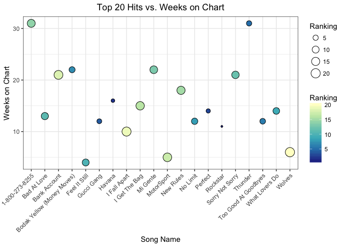
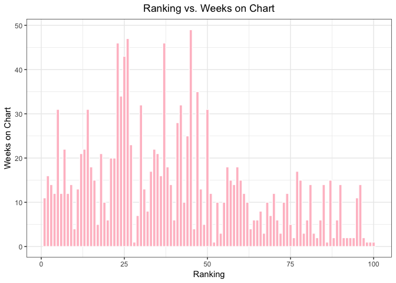

Homework 10: Data from the Web
================

### Load packages

Load necessary packages.

``` r
library(tidyverse)
library(magrittr)
library(purrr)
library(glue)
library(stringr)
library(rvest)
library(xml2)
library(ggplot2)
library(knitr)
```

Scrape data
-----------

### Billboard The Hot 100

Extract data from [Billboard The Hot 100](https://www.billboard.com/charts/hot-100).

``` r
hot_100 <- read_html("https://www.billboard.com/charts/hot-100")
```

### Song name

Let's get a list of the top 10 song names!

``` r
song_name <- hot_100 %>% 
  html_nodes(".chart-row__song") %>% 
  html_text()

head(song_name, 10)
```

    ##  [1] "Rockstar"                   "Havana"                    
    ##  [3] "Perfect"                    "Gucci Gang"                
    ##  [5] "Thunder"                    "Too Good At Goodbyes"      
    ##  [7] "Bodak Yellow (Money Moves)" "No Limit"                  
    ##  [9] "What Lovers Do"             "Feel It Still"

### Artist name

Extract a list of the corresponding arist names.

``` r
artist_name <- hot_100 %>% 
  html_nodes(".chart-row__artist") %>% 
  html_text()

head(artist_name, 10)
```

    ##  [1] "\nPost Malone Featuring 21 Savage\n"      
    ##  [2] "\nCamila Cabello Featuring Young Thug\n"  
    ##  [3] "\nEd Sheeran\n"                           
    ##  [4] "\nLil Pump\n"                             
    ##  [5] "\nImagine Dragons\n"                      
    ##  [6] "\nSam Smith\n"                            
    ##  [7] "\nCardi B\n"                              
    ##  [8] "\nG-Eazy Featuring A$AP Rocky & Cardi B\n"
    ##  [9] "\nMaroon 5 Featuring SZA\n"               
    ## [10] "\nPortugal. The Man\n"

We will remove the leading and trailing whitespace.

``` r
artist_name_mod <- hot_100 %>% 
  html_nodes(".chart-row__artist") %>% 
  html_text() %>% 
  trimws(which = c("both")) ## remove leading and trailing whitespace

head(artist_name_mod, 10)
```

    ##  [1] "Post Malone Featuring 21 Savage"      
    ##  [2] "Camila Cabello Featuring Young Thug"  
    ##  [3] "Ed Sheeran"                           
    ##  [4] "Lil Pump"                             
    ##  [5] "Imagine Dragons"                      
    ##  [6] "Sam Smith"                            
    ##  [7] "Cardi B"                              
    ##  [8] "G-Eazy Featuring A$AP Rocky & Cardi B"
    ##  [9] "Maroon 5 Featuring SZA"               
    ## [10] "Portugal. The Man"

### Ranking

Let's look at the current ranking for each song.

``` r
current_week <- hot_100 %>% 
  html_nodes(".chart-row__current-week") %>% 
  html_text()

head(current_week, 10)
```

    ##  [1] "1"  "2"  "3"  "4"  "5"  "6"  "7"  "8"  "9"  "10"

### Weeks on Chart

Let's also look at the number of weeks the song has been on the chart.

``` r
weeks_on_chart <- hot_100 %>% 
  html_nodes(".chart-row__weeks-on-chart") %>% 
  html_text()

head(weeks_on_chart, 10)
```

    ##  [1] "\nWks on Chart\n11 "  "\nWks on Chart\n16 "  "\n Wks on Chart\n14 "
    ##  [4] "\nWks on Chart\n12 "  "\nWks on Chart\n31 "  "\nWks on Chart\n12 " 
    ##  [7] "\nWks on Chart\n22 "  "\nWks on Chart\n12 "  "\nWks on Chart\n14 " 
    ## [10] "\nWks on Chart\n24  "

We will extract the week on charts value.

``` r
weeks_on_chart_mod <- hot_100 %>% 
  html_nodes(".chart-row__weeks-on-chart") %>% 
  html_text() %>% 
  str_sub(-3,-2) %>% ## extract weeks on chart value
  trimws(which = c("both")) ## trim whitespace for single digits

head(weeks_on_chart_mod, 10)
```

    ##  [1] "11" "16" "14" "12" "31" "12" "22" "12" "14" "4"

### Dataframe

We can put our data together into a data frame. Let's take a look at the top 40 hits!

``` r
song_df <- data.frame(Ranking = as.numeric(current_week),
                      Weeks_on_chart = as.numeric(weeks_on_chart_mod),
                      Song = song_name,
                      Artist = artist_name_mod)

song_df %>% 
  head(40) %>% ## top 40 songs
  kable()
```

|  Ranking|  Weeks\_on\_chart| Song                            | Artist                                            |
|--------:|-----------------:|:--------------------------------|:--------------------------------------------------|
|        1|                11| Rockstar                        | Post Malone Featuring 21 Savage                   |
|        2|                16| Havana                          | Camila Cabello Featuring Young Thug               |
|        3|                14| Perfect                         | Ed Sheeran                                        |
|        4|                12| Gucci Gang                      | Lil Pump                                          |
|        5|                31| Thunder                         | Imagine Dragons                                   |
|        6|                12| Too Good At Goodbyes            | Sam Smith                                         |
|        7|                22| Bodak Yellow (Money Moves)      | Cardi B                                           |
|        8|                12| No Limit                        | G-Eazy Featuring A$AP Rocky & Cardi B             |
|        9|                14| What Lovers Do                  | Maroon 5 Featuring SZA                            |
|       10|                 4| Feel It Still                   | Portugal. The Man                                 |
|       11|                13| Bad At Love                     | Halsey                                            |
|       12|                21| Sorry Not Sorry                 | Demi Lovato                                       |
|       13|                22| Mi Gente                        | J Balvin & Willy William Featuring Beyonce        |
|       14|                31| 1-800-273-8255                  | Logic Featuring Alessia Cara & Khalid             |
|       15|                18| New Rules                       | Dua Lipa                                          |
|       16|                15| I Get The Bag                   | Gucci Mane Featuring Migos                        |
|       17|                 5| MotorSport                      | Migos, Nicki Minaj & Cardi B                      |
|       18|                21| Bank Account                    | 21 Savage                                         |
|       19|                10| I Fall Apart                    | Post Malone                                       |
|       20|                 6| Wolves                          | Selena Gomez X Marshmello                         |
|       21|                20| All I Want For Christmas Is You | Mariah Carey                                      |
|       22|                20| Young Dumb & Broke              | Khalid                                            |
|       23|                46| Despacito                       | Luis Fonsi & Daddy Yankee Featuring Justin Bieber |
|       24|                34| Unforgettable                   | French Montana Featuring Swae Lee                 |
|       25|                43| Believer                        | Imagine Dragons                                   |
|       26|                47| Shape Of You                    | Ed Sheeran                                        |
|       27|                23| Love.                           | Kendrick Lamar Featuring Zacari                   |
|       28|                 1| MIC Drop                        | BTS Featuring Desiigner                           |
|       29|                 7| Let You Down                    | NF                                                |
|       30|                32| Attention                       | Charlie Puth                                      |
|       31|                13| ...Ready For It?                | Taylor Swift                                      |
|       32|                 8| How Long                        | Charlie Puth                                      |
|       33|                17| What About Us                   | P!nk                                              |
|       34|                22| Rake It Up                      | Yo Gotti Featuring Nicki Minaj                    |
|       35|                21| Praying                         | Kesha                                             |
|       36|                16| Silence                         | Marshmello Featuring Khalid                       |
|       37|                46| That's What I Like              | Bruno Mars                                        |
|       38|                18| The Weekend                     | SZA                                               |
|       39|                14| The Way Life Goes               | Lil Uzi Vert Featuring Nicki Minaj                |
|       40|                 6| Meant To Be                     | Bebe Rexha & Florida Georgia Line                 |

### Data analysis

Plot the top 20 songs to the number of weeks it's been on the chart.

``` r
song_df %>% 
  head(20) %>% 
  ggplot(aes(x=Song, y=Weeks_on_chart)) +
  geom_point(shape=21, aes(size=Ranking, fill=Ranking)) +
  theme_bw() +
  labs(title = "Top 20 Hits vs. Weeks on Chart",
       fill = "Ranking",
       size = "Ranking",
       x = "Song Name",
       y = "Weeks on Chart") +
  theme(plot.title = element_text(hjust=0.5),
        axis.text.x = element_text(angle=45, hjust=1)) +
  scale_fill_distiller(palette="YlGnBu")
```



It makes sense that the mid ranked songs have been on the charts longer. People lose interest and want to hear new music!

Let's look at that comparison closely!

``` r
song_df %>% 
  ggplot(aes(x=Ranking, y=Weeks_on_chart)) +
  geom_col(fill="pink", colour="white") +
  theme_bw() +
  labs(title = "Ranking vs. Weeks on Chart",
       x = "Ranking",
       y = "Weeks on Chart") +
  theme(plot.title = element_text(hjust=0.5))
```



Confirmed! Songs ranked around 25-50 have been on the charts for the longest period of time. Almost 6 months to a year! The songs at the bottom of the chart are probably new releases, slowly making their way up the charts.
